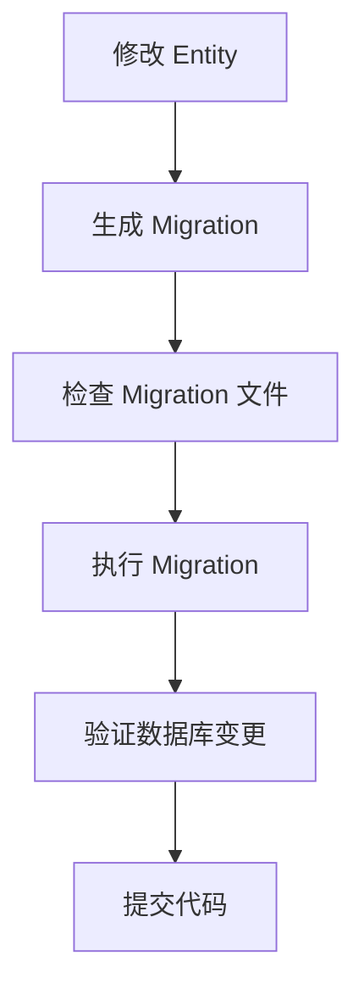

# Migration 最佳实践指南

本文档包含在项目中使用 TypeORM Migration 的最佳实践和常用命令。

## 📋 目录

- [Migration 基础概念](#migration-基础概念)
- [日常开发流程](#日常开发流程)
- [常用命令速查](#常用命令速查)
- [生产环境部署](#生产环境部署)
- [问题排查指南](#问题排查指南)
- [安全检查清单](#安全检查清单)

## 🎯 Migration 基础概念

### 什么是 Migration？

Migration（数据库迁移）是一种版本控制数据库模式变更的方式，它允许：
- 跟踪数据库结构变化
- 在不同环境间同步数据库结构
- 回滚数据库变更
- 团队协作时保持数据库一致性

### 项目 Migration 架构

```
backend/
├── typeorm.config.ts           # TypeORM 配置
├── src/database/
│   ├── entities/               # 实体定义
│   └── migrations/             # Migration 文件
└── package.json               # Migration 脚本
```

## 🔄 日常开发流程

### 标准开发流程



### 详细步骤

#### 1. 修改实体文件
```typescript
// 示例：为 User 实体添加新字段
@Entity('users')
export class User {
  // ... 现有字段

  @Column({ type: 'varchar', length: 20, nullable: true })
  phoneNumber?: string; // 新增字段
}
```

#### 2. 生成 Migration
```bash
# 生成 migration（推荐使用语义化命名）
pnpm --filter backend run migration:generate -- src/database/migrations/AddUserPhoneNumber
```

#### 3. 检查生成的 Migration
```typescript
// 检查生成的文件内容
// src/database/migrations/[timestamp]-AddUserPhoneNumber.ts

export class AddUserPhoneNumber1234567890123 implements MigrationInterface {
    name = 'AddUserPhoneNumber1234567890123'

    public async up(queryRunner: QueryRunner): Promise<void> {
        await queryRunner.query(`ALTER TABLE "users" ADD "phoneNumber" character varying(20)`);
    }

    public async down(queryRunner: QueryRunner): Promise<void> {
        await queryRunner.query(`ALTER TABLE "users" DROP COLUMN "phoneNumber"`);
    }
}
```

#### 4. 执行 Migration
```bash
# 执行 migration
pnpm --filter backend run migration:run

# 查看执行状态
pnpm --filter backend run migration:show
```

#### 5. 验证结果
```bash
# 检查数据库结构
psql -d xiaodashi -c "\d users"

# 或者通过应用构建验证
pnpm --filter backend build
```

## 📚 常用命令速查

### Migration 管理命令

```bash
# 生成 migration（基于实体变化）
pnpm --filter backend run migration:generate -- src/database/migrations/MigrationName

# 创建空白 migration（用于数据迁移等）
pnpm --filter backend run migration:create -- src/database/migrations/MigrationName

# 执行待运行的 migrations
pnpm --filter backend run migration:run

# 回滚最近一次 migration
pnpm --filter backend run migration:revert

# 查看 migration 状态
pnpm --filter backend run migration:show
```

### 常用命令组合

```bash
# 开发阶段：完整流程
pnpm --filter backend run migration:generate -- src/database/migrations/AddNewFeature
pnpm --filter backend run migration:run
pnpm --filter backend run migration:show

# 出错回滚
pnpm --filter backend run migration:revert
# 修复实体定义后重新生成
pnpm --filter backend run migration:generate -- src/database/migrations/FixNewFeature
```

### 预留的多数据库命令

当项目扩展到多数据库时，可以使用以下预留命令（需要去掉 `_` 前缀）：

```bash
# 用户数据库 migration
# _migration:user:generate
# _migration:user:run
# _migration:user:show

# 认证数据库 migration
# _migration:auth:generate
# _migration:auth:run
# _migration:auth:show

# 批量操作
# _migration:all:run      # 运行所有数据库的 migration
# _migration:all:show     # 查看所有数据库的 migration 状态
```

## 🚀 生产环境部署

### 部署前检查清单

- [ ] Migration 在开发环境测试通过
- [ ] 备份生产数据库
- [ ] 确认 Migration 的 down() 方法正确实现
- [ ] 检查 Migration 是否包含破坏性变更
- [ ] 评估 Migration 执行时间（大表操作）

### 部署流程

#### 1. 数据库备份
```bash
# PostgreSQL 备份
pg_dump -h $DB_HOST -U $DB_USER -d $DB_NAME > backup_$(date +%Y%m%d_%H%M%S).sql

# 验证备份文件
ls -la backup_*.sql
```

#### 2. 执行 Migration
```bash
# 在生产服务器上
cd /path/to/backend
pnpm run migration:run

# 验证执行结果
pnpm run migration:show
```

#### 3. 验证和监控
```bash
# 检查应用健康状况
curl http://localhost:3001/health

# 检查数据库连接
pnpm run migration:show
```

### Docker 环境部署

推荐使用 Init Container 模式：

```yaml
# docker-compose.prod.yml
version: '3.8'
services:
  migration-init:
    image: xiaodashi-backend:latest
    command: pnpm run migration:run
    environment:
      - NODE_ENV=production
      - DB_HOST=postgres
    depends_on:
      postgres:
        condition: service_healthy
    restart: "no"  # 只执行一次

  backend:
    image: xiaodashi-backend:latest
    depends_on:
      migration-init:
        condition: service_completed_successfully
    restart: always
```

## 🔍 问题排查指南

### 常见问题和解决方案

#### 1. Migration 生成失败

**错误信息**:
```
Cannot find name 'EntityName'
```

**解决方案**:
```bash
# 检查实体是否正确导出
cat src/database/entities/index.ts

# 检查 TypeORM 配置
cat typeorm.config.ts

# 重新构建项目
pnpm run build
```

#### 2. Migration 执行失败

**错误信息**:
```
relation "table_name" already exists
```

**解决方案**:
```bash
# 检查数据库当前状态
pnpm run migration:show

# 如果 migration 部分执行，可能需要手动清理
psql -d xiaodashi -c "DROP TABLE IF EXISTS table_name;"

# 重新执行
pnpm run migration:run
```

#### 3. 数据库连接问题

**错误信息**:
```
connection "default" was not found
```

**解决方案**:
```bash
# 检查环境变量
echo $DB_HOST $DB_PORT $DB_NAME

# 检查数据库连接
psql -h $DB_HOST -U $DB_USER -d $DB_NAME -c "SELECT 1;"

# 检查 TypeORM 配置
node -e "console.log(require('./typeorm.config.ts').default)"
```

#### 4. Migration 顺序问题

**症状**: Migration 执行顺序不正确

**解决方案**:
- Migration 按时间戳排序执行
- 确保 Migration 文件命名包含正确的时间戳
- 不要手动修改时间戳

### 调试技巧

#### 1. 查看 Migration SQL
```bash
# 生成 migration 时查看生成的 SQL
pnpm run migration:generate -- src/database/migrations/TestMigration

# 查看生成的文件内容
cat src/database/migrations/*-TestMigration.ts
```

#### 2. 手动执行 SQL 测试
```bash
# 连接数据库
psql -h localhost -U postgres -d xiaodashi

# 手动执行 SQL 测试
\d users  -- 查看表结构
```

#### 3. Migration 日志分析
```bash
# 开启 TypeORM 日志
NODE_ENV=development pnpm run migration:run

# 查看详细执行过程
```

## 🛡️ 安全检查清单

### Migration 代码审查

- [ ] **检查 SQL 注入风险**: 避免动态 SQL 拼接
- [ ] **验证数据类型**: 确保字段类型正确
- [ ] **检查约束**: 外键、唯一约束、非空约束
- [ ] **索引优化**: 必要的索引是否添加
- [ ] **性能影响**: 大表操作是否会锁表太久

### 破坏性变更检查

⚠️ **高风险操作**：
- 删除表或列
- 修改列类型（可能导致数据丢失）
- 添加非空约束到已有数据
- 重命名表或列

✅ **安全操作**：
- 添加可空列
- 添加新表
- 添加索引
- 插入默认数据

### 回滚准备

确保每个 Migration 都有正确的 `down()` 方法：

```typescript
export class ExampleMigration implements MigrationInterface {
    async up(queryRunner: QueryRunner): Promise<void> {
        // 正向操作
        await queryRunner.query(`ALTER TABLE "users" ADD "newColumn" varchar(50)`);
    }

    async down(queryRunner: QueryRunner): Promise<void> {
        // 回滚操作 - 必须能完全撤销 up() 的操作
        await queryRunner.query(`ALTER TABLE "users" DROP COLUMN "newColumn"`);
    }
}
```

## 📊 性能优化建议

### 大表 Migration 优化

```typescript
// 分批处理大量数据
async up(queryRunner: QueryRunner): Promise<void> {
    // 避免：一次性处理所有数据
    // await queryRunner.query(`UPDATE users SET status = 'active'`);

    // 推荐：分批处理
    const batchSize = 1000;
    let offset = 0;
    let hasMore = true;

    while (hasMore) {
        const result = await queryRunner.query(`
            UPDATE users
            SET status = 'active'
            WHERE id IN (
                SELECT id FROM users
                WHERE status IS NULL
                ORDER BY id
                LIMIT ${batchSize} OFFSET ${offset}
            )
        `);

        hasMore = result.length === batchSize;
        offset += batchSize;

        // 避免长时间锁表
        await new Promise(resolve => setTimeout(resolve, 100));
    }
}
```

### 索引策略

```typescript
// 在大表上添加索引时，考虑并发创建
async up(queryRunner: QueryRunner): Promise<void> {
    // PostgreSQL 并发创建索引
    await queryRunner.query(`
        CREATE INDEX CONCURRENTLY idx_users_email
        ON users(email)
    `);
}
```

## 🎓 最佳实践总结

### DO ✅

1. **语义化命名**: 使用描述性的 Migration 名称
2. **原子性操作**: 每个 Migration 专注一个功能变更
3. **测试先行**: 先在开发环境完全测试
4. **备份习惯**: 生产环境执行前必须备份
5. **文档记录**: 复杂 Migration 要添加注释说明

### DON'T ❌

1. **修改已执行的 Migration**: 会导致环境不一致
2. **跳过 down() 方法**: 缺少回滚能力
3. **生产环境直接测试**: 风险极高
4. **忽略性能影响**: 大表操作可能影响服务
5. **手写时间戳**: 使用工具生成确保唯一性

---

**相关文档**:
- [数据库实体新增指南](./database-entity-guide.md)
- [TypeORM 官方文档](https://typeorm.io/migrations)

**最后更新**: 2025-01-15
**维护者**: Backend Team